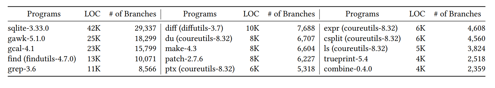

# FeatMaker

FeatMaker automatically generates state features & search strategy for symbolic execution.

## Installation
We recommend to use a docker image for easy and fast installation. To install FeatMaker on local, please follow the instructions on [docker file](Dockerfile)
```bash
$ docker pull skkusal/featmaker
$ docker run --rm -it --ulimit='stack=-1:-1' skkusal/featmaker
```
## Benchmarks
In the docker image, all 15 benchmarks we used are installed in 'root/featmaker/benchmarks'. Details of Benchmakrs are as follow:

## How to run FeatMaker
You can run FeatMaker with following command in 'root/featmaker' directory. There are two required parameters 'pgm(target program)' and 'output_dir(name of experiment directory)'. 
```bash
$ python3 run_featmaker.py --pgm find --output_dir test
```
Also we provided 2 more approaches, original KLEE and naive featmaker (random weights and simply accumulated features). Those experiments can be executed with following commands in 'root/featmaker' directory:
```bash
# run naive
$ python3 run_featmaker.py --main_option naive --pgm find --output_dir test
# run original KLEE
$ python3 run_KLEEdefault.py --pgm find --output_dir test
```
For more details about options in featmaker, you can use following commands:
```bash
$ python3 run_featmaker.py --help
Usage: run_featmaker.py [options]

Options:
  -h, --help            show this help message and exit
  --pgm=PGM             Benchmarks : combine, csplit, diff, du, expr, find,
                        gawk, gcal, grep, ls, make, patch, ptx, sqlite,
                        trueprint
  --output_dir=OUTPUT_DIR
                        Result directory
  --total_budget=TOTAL_TIME
                        Total time budget (sec) (Default: 86400 = 24h)
  --small_budget=SMALL_TIME
                        small time budget (sec) (Default: 120)
  --n_scores=N_SCORES   The number of score functions in one iteration
                        (Default: 20)
  --main_option=MAIN_OPTION
                        Main task to run : featmaker or naive (Default:
                        featmaker)
```
The results will be saved in the 'featmaker_experiments/{output_dir}/{pgm}' directory. FeatMaker generates 4 main outputs.
1. test-cases : 'results/iteration-\*/\*.ktest' files
2. features : 'features/\*.f' files
3. weights : 'weights/iteration-\*/\*.w' files
4. Error cases : 'results/error_inputs' file

## Drawing plot
For visualizing coverage data, we provided ’draw_plot.py’. You can generate a time-coverage graph with a simple command:
```bash
$ python3 draw_plot.py
```
If you want to plot a graph with data from a directory different from the above example, please edit the ’data_dict’ dictionary in [draw_plot.py](./draw_plot.py). This dictionary uses labels of the data as keys and the locations where the data is stored as values.

