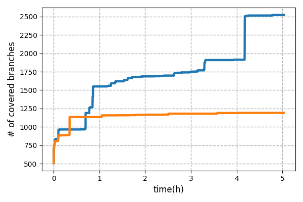

# FeatMaker

FeatMaker automatically generates state features & search strategy for symbolic execution.

## Installation
We recommend to use a [docker file](Dockerfile) for easy and fast installation. To install FeatMaker on local, please follow the instructions on [docker file](Dockerfile)
```bash
$ git clone https://github.com/anonymousfeatmaker/featmaker.git
$ cd featmaker
$ docker build -t featmaker .
$ docker run -it --ulimit='stack=-1:-1' featmaker
```

## How to run FeatMaker
You can run FeatMaker with following command. There are two required parameters 'pgm(target program)' and 'exp_base(name of experiment directory)'. If you have built docker container using a [docker file](Dockerfile), only find-4.7.0 would be built. If you want to test other programs, please refer to the [README.md](benchmarks/README.md). 
```bash
$ python3 run_featmaker.py --pgm {target program} --exp_base {name of directory you want to create}
```
The results will be saved in the featmaker_experiments/{exp_base}/{pgm} directory. FeatMaker saves its all data per each iteration, and you can load the data with python pickle package. 
```
>>> import pickle
>>> with open("featmaker_experiments/{exp_base}/{pgm}/data/{iteration}.pkl", 'rb') as f:
        data = pickle.load(f)
# print # of covered branches
>>> print(len(data['branches']))
```

## Performance of FeatMaker
The following plot illustrates the branch coverage obtained by testing find-4.7.0 with featmaker and KLEE default for 5 hours each. We took each experiment with following command:
```bash
$ python3 run_featmaker.py --pgm find --exp_base FeatMaker --time_budget 18000
$ python3 run_KLEEdefault.py --pgm find --exp_base kleeDefault --time_budget 18000
```

